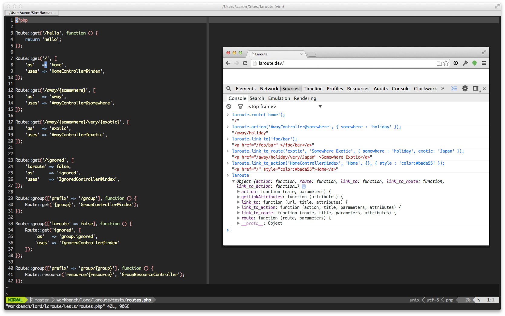

# Laroute

[Laravel](http://laravel.com/) has some pretty sweet [helper functions](http://laravel.com/docs/helpers#urls) for generating urls/links and its auto-json-magic makes it building APIs super easy. It's my go-to choice for building single-page js apps, but routing can quickly become a bit of a pain.

Wouldn't it be amazing if we could access our Laravel routes from JavaScript?

This package allows us to port our routes over to JavaScript, and gives us a bunch of _very familiar_ helper functions to use.



## Installation

Install the usual [composer](https://getcomposer.org/) way.

###### composer.json
```json
{
	"require" : {
		"lord/laroute" : "2.*"
	}
}
```

n.b Laravel 4.x users, check out [version 1.3.2](https://github.com/aaronlord/laroute/tree/v1.3.2)

###### app/config/app.php
```php
	...
	
	'providers' => array(
		...
		Lord\Laroute\LarouteServiceProvider::class,
	],
	
	...
```

### Configure (optional)

Copy the packages config files.

```
php artisan vendor:publish --provider='Lord\Laroute\LarouteServiceProvider'
```

###### app/config/packages/lord/laroute/config.php

```php

return [

    /*
     * The destination path for the javascript file.
     */
    'path' => 'public/js',

    /*
     * The destination filename for the javascript file.
     */
    'filename' => 'laroute',

    /*
     * The namespace for the helper functions. By default this will bind them to
     * `window.laroute`.
     */
    'namespace' => 'laroute',

    /*
     * Generate absolute URLs
     *
     * Set the Application URL in config/app.php
     */
    'absolute' => false,

    /*
     * The Filter Methode
     *
     * 'all' => All routes except "'laroute' => false"
     * 'only' => Only "'laroute' => true" routes
     * 'force' => All routes, ignored "laroute" route parameter
     */
    'filter' => 'all',

    /*
     * Action Namespace
     *
     * Set here your controller namespace (see RouteServiceProvider -> $namespace) for cleaner action calls
     * e.g. 'App\Http\Controllers'
     */
    'action_namespace' => '',

    /*
     * The path to the template `laroute.js` file. This is the file that contains
     * the ported helper Laravel url/route functions and the route data to go
     * with them.
     */
    'template' => 'vendor/lord/laroute/src/templates/laroute.js',
    
    /*
     * Appends a prefix to URLs. By default the prefix is an empty string.
    *
    */
    'prefix' => '',

];

    
```

### Generate the `laroute.js`

To access the routes, we need to "port" them over to a JavaScript file:

```
php artisan laroute:generate
```

With the default configuration, this will create a `public/js/laroute.js` file to include in your page, or build.

```html
<script src="/js/laroute.js"></script>
```

**Note: You'll have to `laroute:generate` if you change your routes.**

## JavaScript Documentation

By default, all of the functions are under the `laroute` namespace. This documentation will stick with this convention.


### action

Generate a URL for a given controller action. 

```js
/** 
 * laroute.action(action, [parameters = {}])
 *
 * action     : The action to route to.
 * parameters : Optional. key:value object literal of route parameters.
 */

laroute.action('HomeController@getIndex');
```

### route

Generate a URL for a given named route.

```js
/**
 * laroute.route(name, [parameters = {}])
 *
 * name       : The name of the route to route to.
 * parameters : Optional. key:value object literal of route parameters.
 */
 
 laroute.route('Hello.{planet}', { planet : 'world' });
```

### url

Generate a fully qualified URL to the given path.

```js
/**
 * laroute.url(name, [parameters = []])
 *
 * name       : The name of the route to route to.
 * parameters : Optional. value array of route parameters.
 */
 
 laroute.url('foo/bar', ['aaa', 'bbb']); // -> /foo/bar/aaa/bbb
```

### link_to

Generate a html link to the given url.

```js
/**
 * laroute.link_to(url, [title = url, attributes = {}]])
 *
 * url        : A relative url.
 * title      : Optional. The anchor text to display
 * attributes : Optional. key:value object literal of additional html attributes.
 */
 
 laroute.link_to('foo/bar', 'Foo Bar', { style : "color:#bada55;" });
```

### link_to_route

Generate a html link to the given route.

```js
/**
 * laroute.link_to_route(name, [title = url, parameters = {}], attributes = {}]]])
 *
 * name       : The name of the route to route to.
 * title      : Optional. The anchor text to display
 * parameters : Optional. key:value object literal of route parameters.
 * attributes : Optional. key:value object literal of additional html attributes.
 */
 
 laroute.link_to_route('home', 'Home');
```

### link_to_action

Generate a html link to the given action.

```js
/**
 * laroute.link_to_action(action, [title = url, parameters = {}], attributes = {}]]])
 *
 * action     : The action to route to.
 * title      : Optional. The anchor text to display
 * parameters : Optional. key:value object literal of route parameters.
 * attributes : Optional. key:value object literal of additional html attributes.
 */
 
 laroute.link_to_action('HelloController@planet', undefined, { planet : 'world' });
```

## PHP Documentation

### Ignore/Filter Routes

By default, all routes are available to laroute after a `php artisan laroute:generate`. However, it is sometimes desirable to have laroute ignore certain routes. You can do this by passing a `laroute` route option.

```php
Route::get('/ignore-me', [
    'laroute' => false,
    'as'      => 'ignoreme',
    'uses'    => 'IgnoreController@me'
]);

Route::group(['laroute' => false], function () {
    Route::get('/groups-are-super-useful', 'GroupsController@index');
});

```


## Licence

[View the licence in this repo.](https://github.com/aaronlord/laroute/blob/master/LICENSE)
